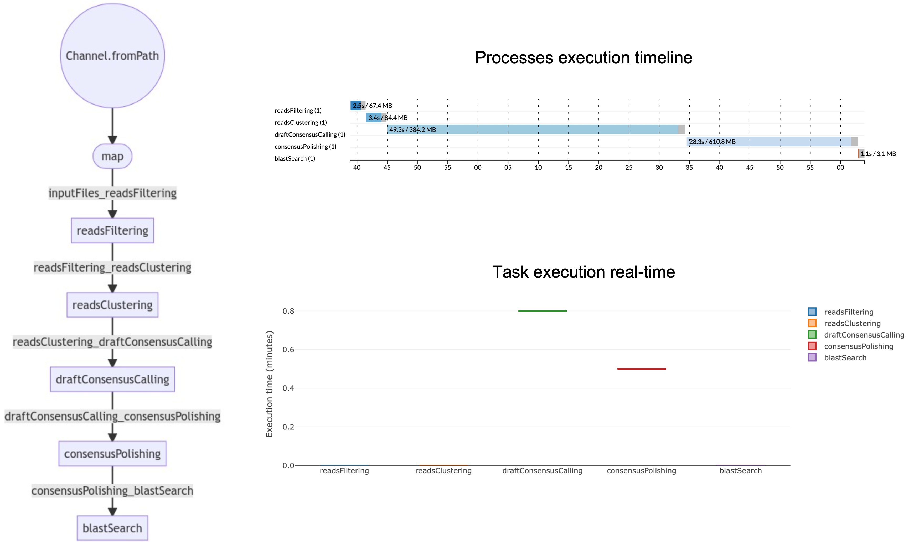

# ONTrack2
A Nextflow MinION-based pipeline for tracking species biodiversity

**ONTrack2** is a [Nextflow](https://www.nextflow.io) implementation of [ONTrack](https://github.com/MaestSi/ONTrack) pipeline, a rapid and accurate MinION-based barcoding pipeline for tracking species biodiversity on site; starting from MinION sequence reads in fastq format. The ONTrack2 pipeline is able to provide accurate consensus sequences in ~15 minutes per sample on a standard laptop.

<p align="center">
  
</p>

## Getting started

**Prerequisites**

* [Nextflow](https://nf-co.re/usage/installation)
* [Docker](https://docs.docker.com/engine/install/) or [Singularity](https://sylabs.io/guides/3.0/user-guide/installation.html)
* NCBI nt database (optional, in case you want to perform a local Blast analysis of your consensus sequences)

For downloading the database (~210 GB):

```
mkdir NCBI_nt_db
cd NCBI_nt_db
echo `date +%Y-%m-%d` > download_date.txt
wget ftp://ftp.ncbi.nlm.nih.gov/blast/db/nt*
targz_files=$(find . | grep "\\.tar\\.gz$")
for f in $targz_files; do
  tar -xzvf $f;
  rm $f;
  rm $f".md5";
done
```
                                                                                   
**Installation**

```
git clone https://github.com/MaestSi/ONTrack2.git
cd ONTrack2
chmod 755 *
```

## Overview

<p align="center">
  
</p>

## Usage

The ONTrack2 pipeline requires you to open ONTrack2.conf configuration file and set the desired options. Then, you can run the pipeline using either docker or singularity environments just specifying a value for the -profile variable.

```
Usage:
nextflow -c ONTrack2.conf run ONTrack2.nf --fastq_files = "/path/to/files*.fastq" --scripts_dir = "/path/to/scripts_dir" --results_dir = "/path/to/results_dir" -profile docker

Mandatory argument:
-profile                                                              Configuration profile to use. Available: docker, singularity
Other mandatory arguments which may be specified in the ONTrack2.conf file
--fastq_files                                                         Path to fastq files, use wildcards to select multiple samples
--results_dir                                                         Path to a folder where to store results
--scripts_dir                                                         scripts_dir is the directory containing all scripts
--minQ                                                                min Q value for reads filtering
--minLen                                                              min read length for reads filtering
--maxLen                                                              max read length for reads filtering
--target_reads_consensus                                              target_reads_consensus defines the maximum number of reads used for consensus calling
--target_reads_polishing                                              target_reads_polishing defines the maximum number of reads used for consensus polishing
--clustering_id_threshold                                             identity threshold for clustering preliminary allele assembly
--plurality                                                           MAFFT plurality value: minimum fraction of aligned reads supporting a basis for including it in the preliminary consensus
--fast_alignment_flag                                                 set fast_alignment_flag=1 if you want to perform fast multiple sequence alignment; otherwise set fast_alignment_flag=0
--primers_length                                                      primers_length defines how many bases are trimmed from consensus sequences
--medaka_model                                                        medaka model for consensus polishing
--blast_db                                                            path to Blast-indexed database for Blasting consensus sequences
```

## Citation

If this tool is useful for your work, please consider citing our [manuscript](https://www.mdpi.com/2073-4425/10/6/468).

Maestri S, Cosentino E, Paterno M, Freitag H, Garces JM, Marcolungo L, Alfano M, Njunjić I, Schilthuizen M, Slik F, Menegon M, Rossato M, Delledonne M. A Rapid and Accurate MinION-Based Workflow for Tracking Species Biodiversity in the Field. Genes. 2019; 10(6):468.

For further information and insights into pipeline development, please have a look at my [doctoral thesis](https://iris.univr.it/retrieve/handle/11562/1042782/205364/PhD_thesis_Simone_Maestri.pdf).

Maestri, S (2021). Development of novel bioinformatic pipelines for MinION-based DNA barcoding (Doctoral thesis, Università degli Studi di Verona, Verona, Italy). Retrieved from https://iris.univr.it/retrieve/handle/11562/1042782/205364/.

## Side notes

As a real-life _Pokédex_, the workflow described in our [manuscript](https://www.mdpi.com/2073-4425/10/6/468) will facilitate tracking biodiversity in remote and biodiversity-rich areas. For instance, during a [Taxon Expedition](https://taxonexpeditions.com/) to Borneo, our analysis confirmed the novelty of a [beetle](https://www.theguardian.com/science/2018/apr/30/new-beetle-species-named-after-leonardo-dicaprio) species named after Leonardo DiCaprio.
